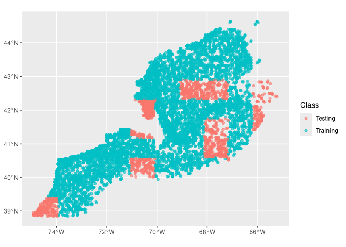
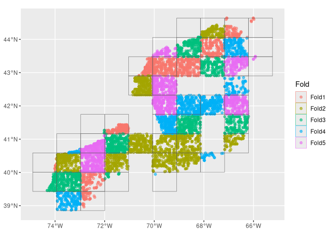
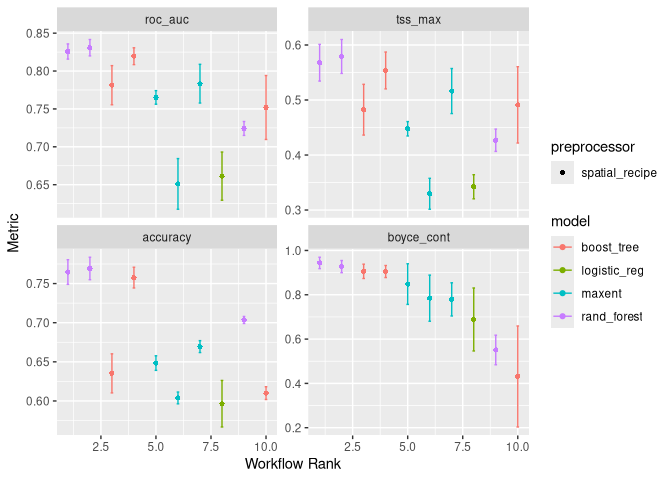
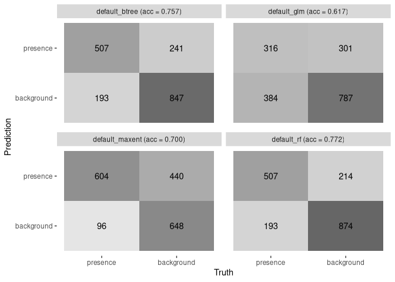
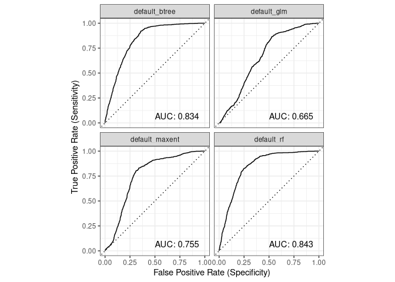
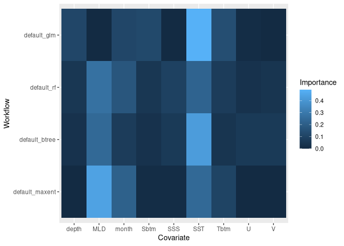
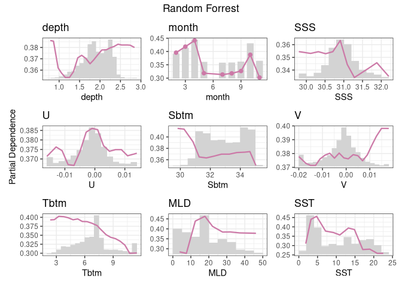

C04_assignment.Rmd
================

``` r
source("/home/cjboxw26/ColbyForecasting/setup.R")
```

## Goal

Currently, our main goal is to compare a variety of models to figure out
which one is best able to determine the difference between actual
presences of Atlantic herring (Clupea harengus) and background points.
This data will later be used to forecast the distribution of Atlantic
herring in the years 2055 and 2075.

## Preparing the data

To begin, we need to split the data into two groups: training and
testing. The models will be trained using the training data, and then
assessed using the testing data. Let’s load the data we need:

``` r
cfg = read_configuration(scientificname = "Clupea harengus", version = "v1")
model_input = read_model_input(scientificname = "Clupea harengus", 
                               version = "v1",
                               log_me = c("depth", "Xbtm")) |>
  dplyr::mutate(month = month_as_number(.data$month)) |>
  select(all_of(c("class", cfg$keep)))
```

Next, let’s split the data into training and testing groups:

``` r
model_input_split = spatial_initial_split(model_input, 
                        prop = 1 / 5,     # 20% for testing
                        strategy = spatial_block_cv) # see ?spatial_block_cv
```

We can also visualize this split like so:

``` r
autoplot(model_input_split)
```

<!-- -->

Next, we split the training data into multiple smaller mini-datasets
called folds to further improve the models. Here’s a visualization:

``` r
tr_data = training(model_input_split)
cv_tr_data <- spatial_block_cv(tr_data,
  v = 5,     
  cellsize = grid_cellsize(model_input),
  offset = grid_offset(model_input) + 0.00001
)
autoplot(cv_tr_data)
```

<!-- -->

## Preparing a recipe

Now that we’ve loaded and prepared the data, we need to make a “recipe”
that essentially tells the models what data to use and the relationship
between the variables. This is done by giving the models a row of
training data as shown in the following code block:

``` r
one_row_of_training_data = dplyr::slice(tr_data,1)
rec = recipe(one_row_of_training_data, formula = class ~ .)
```

For us humans, we can use this code to see the various relationships
between the variables:

``` r
summary(rec)
```

    ## # A tibble: 12 × 4
    ##    variable type      role      source  
    ##    <chr>    <list>    <chr>     <chr>   
    ##  1 depth    <chr [2]> predictor original
    ##  2 month    <chr [2]> predictor original
    ##  3 SSS      <chr [2]> predictor original
    ##  4 U        <chr [2]> predictor original
    ##  5 Sbtm     <chr [2]> predictor original
    ##  6 V        <chr [2]> predictor original
    ##  7 Tbtm     <chr [2]> predictor original
    ##  8 MLD      <chr [2]> predictor original
    ##  9 SST      <chr [2]> predictor original
    ## 10 X        <chr [2]> coords    original
    ## 11 Y        <chr [2]> coords    original
    ## 12 class    <chr [3]> outcome   original

## Preparing models workflows

Next, we need to prepare the workflows for our models. Here we use 4
different models since each one uses a different algorithm and therefore
will produce slightly different results. Out goal is to find which one
does the best at differentiating presences and background points. In the
following code we set up workflows for a generalized mixed model (glm),
a random forest (rf), boosted regression trees (gbm), and maximum
entropy (maxent) to determine the best hyperparameter values.

``` r
wflow = workflow_set(
  
  preproc = list(default = rec), # not much happening in our preprocessor
  
  models = list(                 # but we have 4 models to add
    
      # very simple - nothing to tune
      glm = logistic_reg(
          mode = "classification") |>
        set_engine("glm"),
      
      # two knobs to tune
      rf = rand_forest(
          mtry = tune(),
          trees = tune(),
          mode = "classification") |>
        set_engine("ranger", 
                   importance = "impurity"),
      
      # so many things to tune!
      btree = boost_tree(
          mtry = tune(), 
          trees = tune(), 
          tree_depth = tune(), 
          learn_rate = tune(), 
          loss_reduction = tune(), 
          stop_iter = tune(),
          mode = "classification") |>
        set_engine("xgboost"),
    
      # just two again
      maxent = maxent(
          feature_classes = tune(),
          regularization_multiplier = tune(),
          mode = "classification") |>
        set_engine("maxnet")
  )
)
```

Next, we tell the models to maximize accuracy

``` r
metrics = sdm_metric_set(yardstick::accuracy)
```

Finally, since we don’t know which of the parameters in the workflow
will be most accurate, we’re going to let the models tune themselves:

``` r
wflow <- wflow |>
  workflow_map("tune_grid",
    resamples = cv_tr_data, 
    grid = 3,
    metrics = metrics, 
    verbose = TRUE)
```

    ## i    No tuning parameters. `fit_resamples()` will be attempted

    ## i 1 of 4 resampling: default_glm

    ## ✔ 1 of 4 resampling: default_glm (1.1s)

    ## i 2 of 4 tuning:     default_rf

    ## i Creating pre-processing data to finalize 1 unknown parameter: "mtry"

    ## ✔ 2 of 4 tuning:     default_rf (4m 35.1s)

    ## i 3 of 4 tuning:     default_btree

    ## i Creating pre-processing data to finalize 1 unknown parameter: "mtry"

    ## → A | warning: `early_stop` was reduced to 0.

    ## There were issues with some computations   A: x1There were issues with some computations   A: x2There were issues with some computations   A: x3There were issues with some computations   A: x4There were issues with some computations   A: x5There were issues with some computations   A: x5
    ## ✔ 3 of 4 tuning:     default_btree (1m 24.4s)
    ## i 4 of 4 tuning:     default_maxent
    ## ✔ 4 of 4 tuning:     default_maxent (6.2s)

This process takes a while, but afterwards we can visualize the various
models:

``` r
autoplot(wflow)
```

<!-- -->

## Choosing the best model

Now that the models have run, lets select and store the best
hyperparamters for future modeling:

``` r
model_fits = workflowset_selectomatic(wflow, model_input_split,
                                  filename = "Clupea-harengus-v1-model_fits",
                                  path = data_path("models"))
```

Next, we’re going to downsize to a singular model. We’re going to use a
variety of visualizations to accomplish this, but let’s start with some
simple summary statistics:

``` r
model_fit_metrics(model_fits)
```

    ## # A tibble: 4 × 5
    ##   wflow_id       accuracy boyce_cont roc_auc tss_max
    ##   <chr>             <dbl>      <dbl>   <dbl>   <dbl>
    ## 1 default_glm       0.617      0.713   0.665   0.336
    ## 2 default_rf        0.772      0.994   0.843   0.577
    ## 3 default_btree     0.757      0.955   0.834   0.562
    ## 4 default_maxent    0.700      0.842   0.755   0.492

We can also plot confusion matricies, which will give more details on
the accuracy of each model.

``` r
model_fit_confmat(model_fits)
```

<!-- -->

This accuracy can also be represented by Area Under the Curve (AUC)
plots:

``` r
model_fit_roc_auc(model_fits)
```

<!-- -->

Or, if we want to see which variable was most important for each model,
we can do so like this:

``` r
model_fit_varimp_plot(model_fits)
```

<!-- -->

Since the random forest performed the best out of all the models, let’s
go ahead and examine the metrics of the best hyperparameters:

``` r
rf = model_fits |>
  filter(wflow_id == "default_rf")
rf$.metrics[[1]]
```

    ## # A tibble: 4 × 4
    ##   .metric    .estimator .estimate .config        
    ##   <chr>      <chr>          <dbl> <chr>          
    ## 1 accuracy   binary         0.772 pre0_mod0_post0
    ## 2 boyce_cont binary         0.994 pre0_mod0_post0
    ## 3 roc_auc    binary         0.843 pre0_mod0_post0
    ## 4 tss_max    binary         0.577 pre0_mod0_post0

Finally, we can also examine relative contribution of each variable
influence over it’s full range of values via a partial dependence plot:

``` r
model_fit_pdp(model_fits, wid = "default_rf", title = "Random Forrest")
```

<!-- -->
